# Casual Inference: Cardiovascular Health, Smoking, and Causal Analysis

## Overview

This project presents a comprehensive statistical, epidemiological, causal inference, and machine learning analysis of cardiovascular health data.

The primary research focus is the relationship between **smoking exposure and cardiovascular disease**, with the analysis progressing from descriptive statistics and conventional regression modelling to causal inference and machine learning.

The project is designed to answer three distinct types of questions:

1. **Descriptive:** What are the characteristics of the study population?
2. **Causal:** What is the potential effect of smoking on cardiovascular outcomes under explicit causal assumptions?
3. **Predictive:** How accurately can cardiovascular outcomes be predicted, and which variables contribute most to those predictions?

The project integrates:

* Descriptive statistics
* Exploratory data analysis
* Probability
* Hypothesis testing
* Correlation analysis
* Linear regression
* Logistic regression
* Model diagnostics
* Directed Acyclic Graphs (DAGs)
* Propensity Score Matching (PSM)
* Inverse Probability Weighting (IPW)
* Doubly Robust Estimation
* Instrumental Variable (IV) analysis
* Difference-in-Differences (DiD)
* Regression Discontinuity Design (RDD)
* Sensitivity analysis
* Random Forest
* XGBoost
* SHAP model interpretation

The project is implemented in **R** and organized as an RStudio Project to support reproducibility and modular analysis.

---

# Research Objective

The primary objective is to investigate the relationship between smoking exposure and cardiovascular disease and to assess how different statistical and causal inference approaches affect the estimated relationship.

The project addresses the following questions:

1. What are the demographic and clinical characteristics of the study population?
2. How do smokers and non-smokers differ in their baseline characteristics?
3. What associations exist between smoking and cardiovascular outcomes?
4. Which factors are associated with cardiovascular disease?
5. How does covariate adjustment affect estimated associations?
6. Can causal inference methods reduce bias due to measured confounding?
7. How consistent are estimates obtained using different causal inference approaches?
8. How sensitive are causal conclusions to potential unmeasured confounding?
9. Which variables are most important for predicting cardiovascular disease?
10. How accurately can machine learning models predict cardiovascular outcomes?
11. How can machine learning predictions be interpreted?

---

# Project Structure

```text
Casual Inference/
│
├── Casual Inference.Rproj
├── README.md
│
├── data/
│   ├── cardio_train.csv
│   ├── cleaned_cardio_data.rds
│   ├── propensity_matched_data.rds
│   ├── xgboost_cardio_model.model
│   ├── xgboost_matrices.RData
│   │
│   ├── figure1_bmi_distribution.png
│   ├── figure2_bp_boxplot.png
│   ├── figure3_clt_proof.png
│   ├── figure4_correlation_heatmap.png
│   ├── figure5_roc_curve.png
│   ├── figure6_causal_dag.png
│   ├── figure7_balance_love_plot.png
│   ├── figure8_rdd_plot.png
│   ├── figure9_sensitivity_contour.png
│   ├── figure10_feature_importance.png
│   ├── figure11_xgboost_importance.png
│   └── figure12_shap_summary_plot.png
│
└── scripts/
    ├── 01_install_packages.R
    ├── 02_import_data.R
    ├── 03_data_cleaning.R
    ├── 04_descriptive_statistics.R
    ├── 05_visualization.R
    ├── 06_probability.R
    ├── 07_hypothesis_testing.R
    ├── 08_correlation.R
    ├── 09_linear_regression.R
    ├── 10_logistic_regression.R
    ├── 11_model_diagnostics.R
    ├── 12_DAG.R
    ├── 13_propensity_score_matching.R
    ├── 14_inverse_probability_weighting.R
    ├── 15_doubly_robust_estimation.R
    ├── 16_instrumental_variables.R
    ├── 17_difference_in_differences.R
    ├── 18_regression_discontinuity.R
    ├── 19_sensitivity_analysis.R
    ├── 20_random_forest.R
    ├── 21_xgboost.R
    └── 22_shap.R
```

---

# Analytical Workflow

```text
                         RAW DATA
                            │
                            ▼
                 DATA IMPORT & CLEANING
                     Scripts 01–03
                            │
                            ▼
              DESCRIPTIVE & STATISTICAL ANALYSIS
                     Scripts 04–11
                            │
                            ▼
                   CAUSAL FRAMEWORK
                      Script 12: DAG
                            │
             ┌──────────────┴──────────────┐
             ▼                             ▼
     OBSERVATIONAL CAUSAL            QUASI-EXPERIMENTAL
        METHODS                         METHODS
      Scripts 13–15                    Scripts 16–18
             │                             │
             └──────────────┬──────────────┘
                            ▼
                  SENSITIVITY ANALYSIS
                       Script 19
                            │
                            ▼
                  MACHINE LEARNING
                     Scripts 20–22
                            │
                            ▼
                 RESULTS & INTERPRETATION
```

---

# Data

The primary raw dataset is:

`data/cardio_train.csv`

The cleaned analytical dataset is:

`data/cleaned_cardio_data.rds`

Intermediate analytical datasets and trained machine learning models are stored in the `data/` directory.

The exact variable definitions and transformations should be referenced in:

`scripts/03_data_cleaning.R`

---

# Key Variables

| Variable    | Description                    |
| ----------- | ------------------------------ |
| `A`         | Smoking exposure variable      |
| `age_years` | Age in years                   |
| `bmi`       | Body mass index                |
| `ap_hi`     | Systolic blood pressure        |
| `cardio`    | Cardiovascular disease outcome |

The smoking exposure variable is currently defined as:

```text
0 = Non-smoker
1 = Smoker
```

The final definitions should always be verified against the data-cleaning script.

---

# Analysis Pipeline

## 1. Data Preparation

### `01_install_packages.R`

Installs the packages required for the project.

### `02_import_data.R`

Imports the raw cardiovascular dataset.

### `03_data_cleaning.R`

Cleans and prepares the analytical dataset.

Output:

`data/cleaned_cardio_data.rds`

---

# 2. Descriptive and Statistical Analysis

Scripts `04–11` provide the conventional statistical analysis.

## `04_descriptive_statistics.R`

Summarizes:

* Sample size
* Age
* BMI
* Systolic blood pressure
* Smoking distribution
* Baseline characteristics
* Skewness

## `05_visualization.R`

Generates exploratory visualizations.

### BMI Distribution

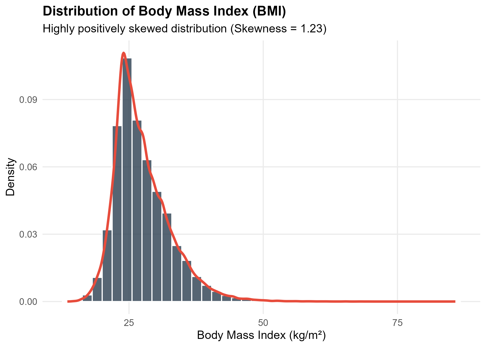

[Open BMI distribution figure](data/figure1_bmi_distribution.png)

### Blood Pressure by Group

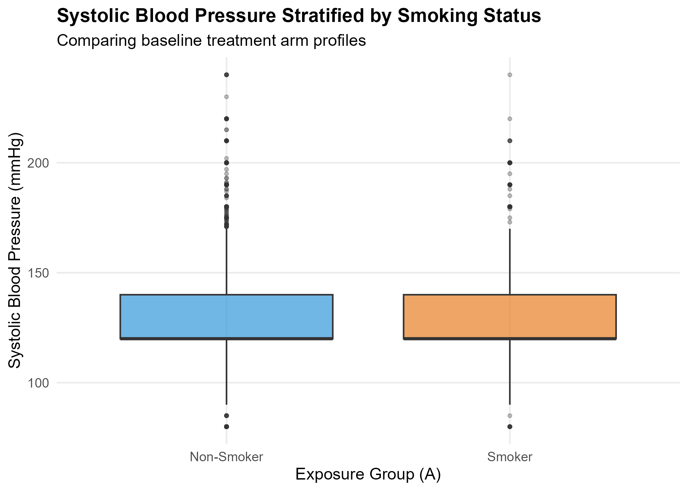

[Open blood pressure boxplot](data/figure2_bp_boxplot.png)

## `06_probability.R`

Explores probability concepts relevant to cardiovascular outcomes and risk.

## `07_hypothesis_testing.R`

Performs statistical hypothesis tests to assess differences and associations between variables and exposure groups.

## `08_correlation.R`

Examines correlations among continuous variables.

### Correlation Heatmap

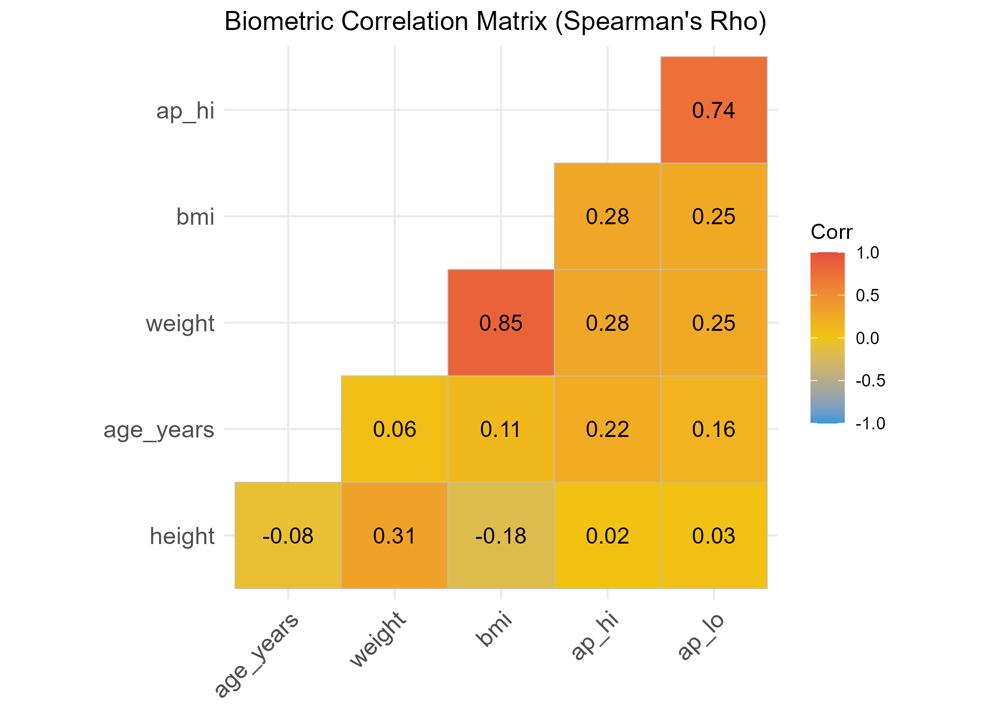

[Open correlation heatmap](data/figure4_correlation_heatmap.png)

## `09_linear_regression.R`

Uses linear regression to investigate relationships between continuous outcomes and explanatory variables.

## `10_logistic_regression.R`

Uses logistic regression to model cardiovascular disease as a binary outcome.

Potential outputs include:

* Odds ratios
* Confidence intervals
* P-values
* Predicted probabilities
* Model fit statistics

## `11_model_diagnostics.R`

Evaluates statistical model assumptions and performance.

---

# 3. Causal Inference Framework

## `12_DAG.R` — Causal Model Specification

The DAG provides the conceptual foundation for the causal analysis.

It is used to:

* Define the causal question
* Identify potential confounders
* Determine adjustment strategies
* Make causal assumptions explicit

### Causal DAG

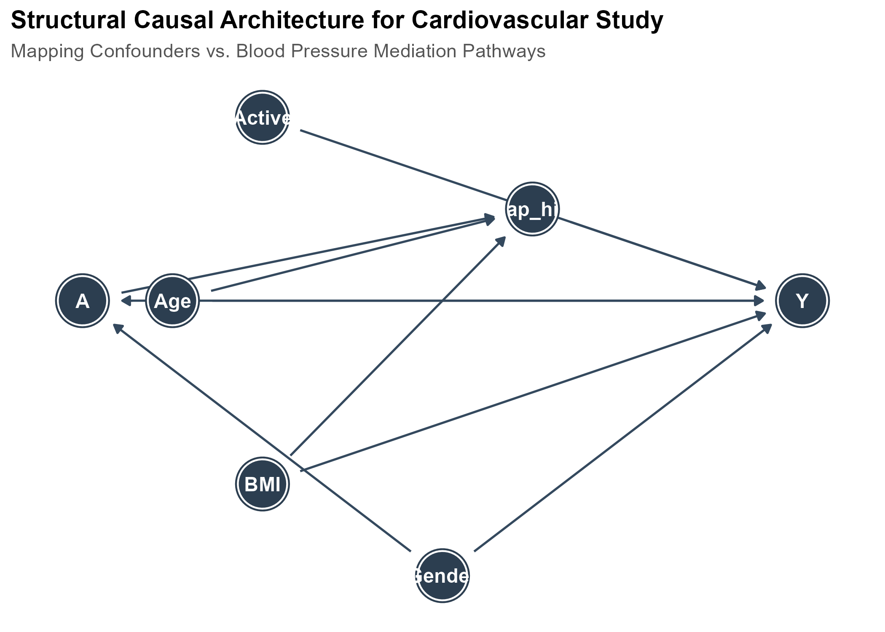

[Open causal DAG](data/figure6_causal_dag.png)

---

## `13_propensity_score_matching.R` — Propensity Score Matching

PSM attempts to create a more comparable sample of smokers and non-smokers based on observed covariates.

Output:

`data/propensity_matched_data.rds`

### Covariate Balance

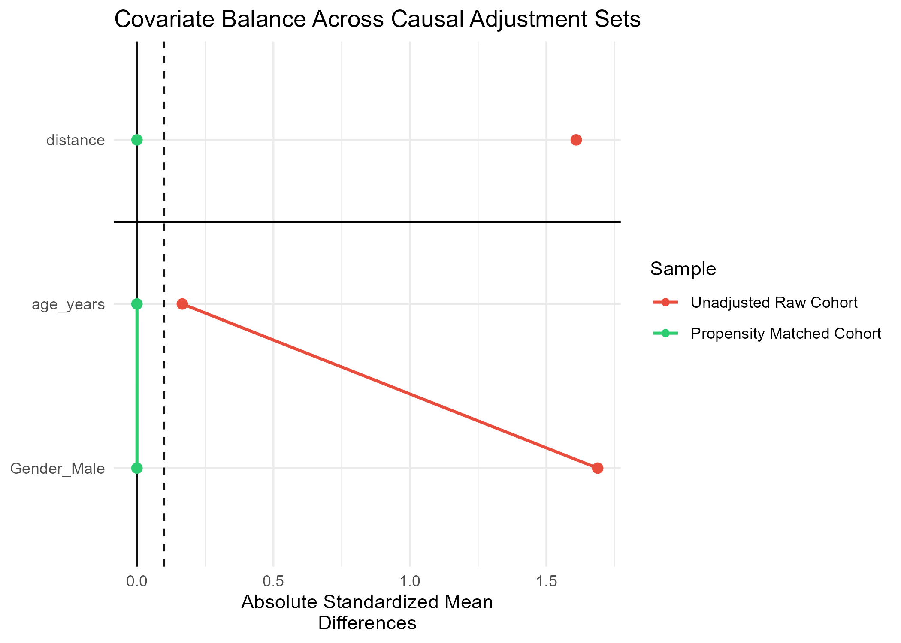

[Open Love plot](data/figure7_balance_love_plot.png)

### Interpretation

PSM is potentially appropriate for this observational dataset if:

* The relevant confounders are measured.
* There is sufficient overlap in propensity scores.
* The matching model is appropriately specified.

PSM cannot eliminate bias due to unmeasured confounding.

**Status: Applicable observational causal method, subject to assumptions.**

---

## `14_inverse_probability_weighting.R` — Inverse Probability Weighting

IPW creates a weighted pseudo-population in which measured covariates are balanced across exposure groups.

Important assumptions include:

* Positivity
* Consistency
* Correct treatment model specification
* No unmeasured confounding

**Status: Applicable observational causal method, subject to assumptions.**

---

## `15_doubly_robust_estimation.R` — Doubly Robust Estimation

Doubly robust estimation combines treatment/exposure modelling with outcome modelling.

It provides an additional approach for estimating causal effects and allows comparison with PSM and IPW.

**Status: Applicable observational causal method, subject to assumptions.**

---

# 4. Methods Requiring Additional Identification Strategies

The following methods are included in the project because they are important causal inference frameworks. However, they should **not automatically be interpreted as valid causal estimates** unless the underlying data satisfy the necessary design requirements.

This distinction is critical for scientific validity.

---

## `16_instrumental_variables.R` — Instrumental Variables

IV analysis requires a credible instrument satisfying:

1. Relevance
2. Independence
3. Exclusion restriction

A standard observational cardiovascular dataset does not automatically contain a valid instrumental variable.

Therefore, this analysis should be interpreted as:

> **Methodological exploration unless a scientifically defensible instrument has been established.**

**Status: Requires a validated instrument.**

---

## `17_difference_in_differences.R` — Difference-in-Differences

DiD requires:

* Treatment and comparison groups
* Pre-intervention observations
* Post-intervention observations
* A credible parallel trends assumption

If the cardiovascular dataset is cross-sectional, conventional DiD estimation is not directly supported.

Therefore, this component should be interpreted as:

> **Methodological demonstration unless longitudinal, repeated cross-sectional, or panel data are available.**

**Status: Requires longitudinal or repeated observations.**

---

## `18_regression_discontinuity.R` — Regression Discontinuity

RDD requires:

* A continuous running variable
* A clearly defined treatment threshold
* Treatment assignment determined by the threshold
* No manipulation around the cutoff
* Continuity of potential outcomes around the cutoff

A cardiovascular dataset does not automatically provide a valid RDD design.

### RDD Visualization

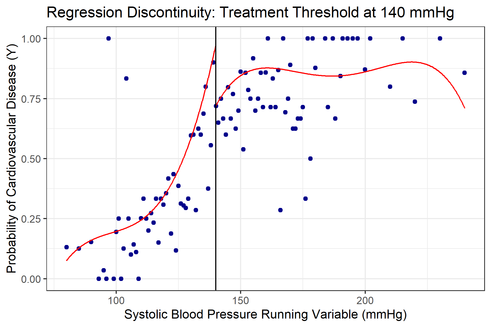

[Open RDD plot](data/figure8_rdd_plot.png)

Therefore:

> The RDD visualization should not be interpreted as evidence of a causal discontinuity unless the running variable and cutoff represent a genuine treatment assignment mechanism.

**Status: Requires a valid threshold-based treatment assignment mechanism.**

---

# 5. Sensitivity Analysis

## `19_sensitivity_analysis.R`

Sensitivity analysis evaluates how robust causal conclusions are to potential unmeasured confounding.

### Sensitivity Contour

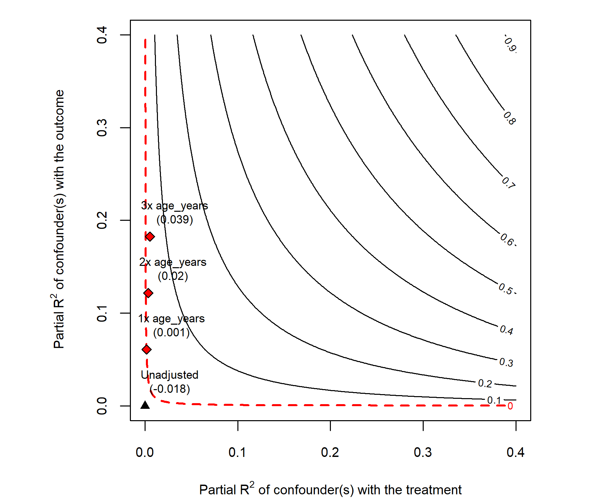

[Open sensitivity contour](data/figure9_sensitivity_contour.png)

Sensitivity analysis helps quantify how strong an unmeasured confounder would need to be to substantially alter the estimated effect.

**Status: Supports interpretation of observational causal estimates.**

---

# 6. Machine Learning

The machine learning component is explicitly separated from the causal inference component.

Machine learning addresses:

> **Can we accurately predict cardiovascular disease?**

Causal inference addresses:

> **What is the potential effect of changing smoking exposure on cardiovascular disease?**

These questions should not be conflated.

---

## `20_random_forest.R` — Random Forest

Trains a Random Forest model for cardiovascular outcome prediction.

The analysis includes model training, prediction, performance evaluation, and feature importance.

### Feature Importance

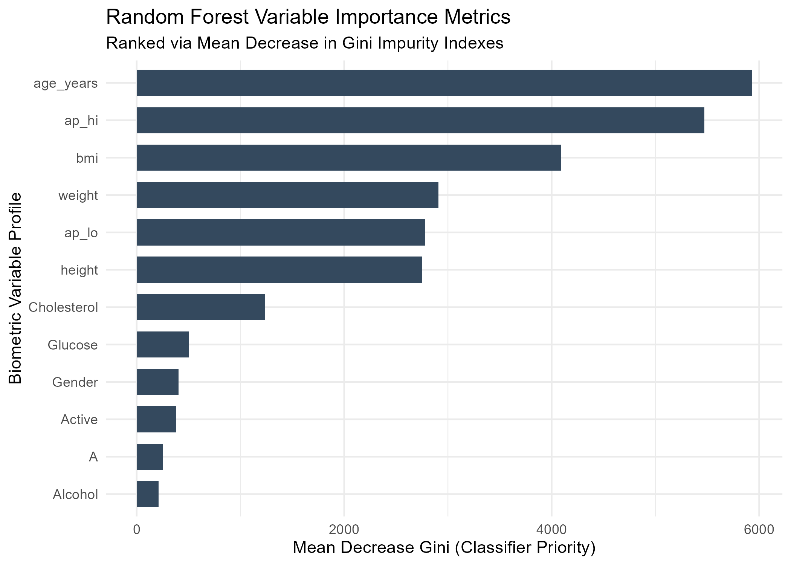

[Open Random Forest feature importance](data/figure10_feature_importance.png)

Feature importance reflects predictive contribution and does **not** establish causality.

---

## `21_xgboost.R` — XGBoost

Trains an Extreme Gradient Boosting model for cardiovascular outcome prediction.

Model objects include:

```text
data/xgboost_cardio_model.model
data/xgboost_matrices.RData
```

### ROC Curve

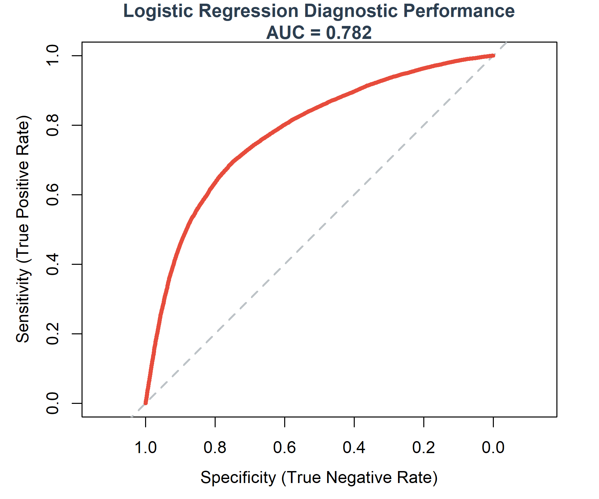

[Open ROC curve](data/figure5_roc_curve.png)

### XGBoost Feature Importance

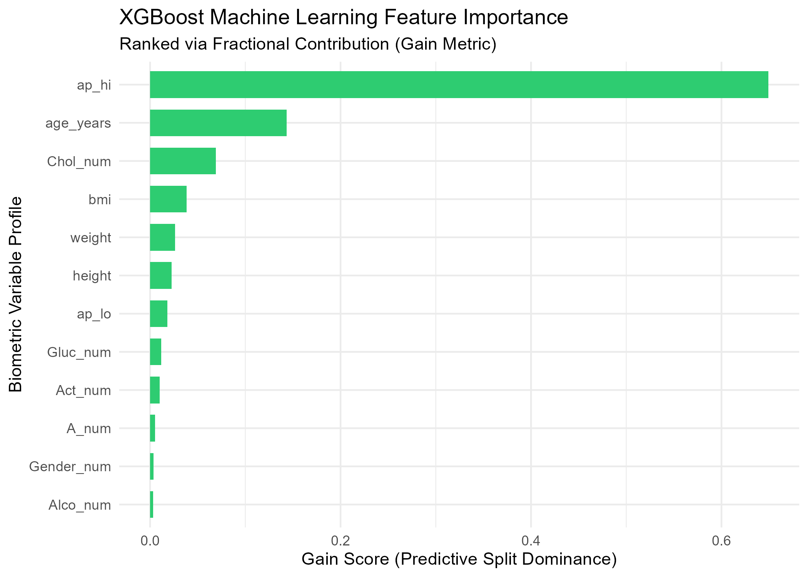

[Open XGBoost feature importance](data/figure11_xgboost_importance.png)

Predictive performance should be assessed using appropriate validation procedures and should ideally include an independent test set or cross-validation.

---

## `22_shap.R` — SHAP Explainability

SHAP analysis is used to interpret XGBoost predictions.

SHAP can help explain:

* Which features contribute most to predictions
* Whether features increase or decrease predicted risk
* How individual predictions are constructed
* Heterogeneity in model predictions

### SHAP Summary Plot

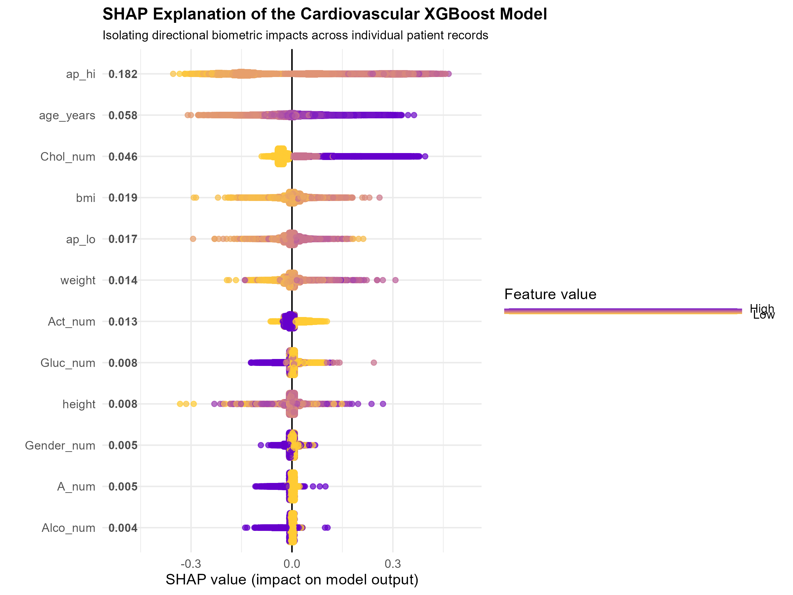

[Open SHAP summary plot](data/figure12_shap_summary_plot.png)

SHAP explanations describe the behaviour of the trained model. They do not demonstrate that a feature has a causal effect on cardiovascular disease.

---

# Summary of Methodological Applicability

| Method                    | Primary Purpose                     | Applicability                       |
| ------------------------- | ----------------------------------- | ----------------------------------- |
| Descriptive statistics    | Describe cohort                     | Directly applicable                 |
| Visualization             | Explore data                        | Directly applicable                 |
| Hypothesis testing        | Statistical inference               | Directly applicable                 |
| Correlation               | Measure association                 | Directly applicable                 |
| Linear regression         | Estimate associations               | Applicable with assumptions         |
| Logistic regression       | Model binary outcome                | Applicable with assumptions         |
| Model diagnostics         | Assess model validity               | Directly applicable                 |
| DAG                       | Define causal assumptions           | Directly applicable                 |
| Propensity Score Matching | Address measured confounding        | Applicable with assumptions         |
| IPW                       | Create balanced pseudo-population   | Applicable with assumptions         |
| Doubly Robust Estimation  | Causal effect estimation            | Applicable with assumptions         |
| Instrumental Variables    | Causal identification               | Requires valid instrument           |
| Difference-in-Differences | Quasi-experimental causal inference | Requires longitudinal/repeated data |
| Regression Discontinuity  | Local causal inference              | Requires valid cutoff               |
| Sensitivity analysis      | Assess robustness                   | Applicable                          |
| Random Forest             | Prediction                          | Applicable                          |
| XGBoost                   | Prediction                          | Applicable                          |
| SHAP                      | Model interpretation                | Applicable                          |

---

# Key Visual Outputs

The main visual outputs generated by the project are shown below.

## Exploratory Analysis

| Visualization          | Preview                                             |
| ---------------------- | --------------------------------------------------- |
| BMI Distribution       | [View figure](data/figure1_bmi_distribution.png)    |
| Blood Pressure Boxplot | [View figure](data/figure2_bp_boxplot.png)          |
| CLT Demonstration      | [View figure](data/figure3_clt_proof.png)           |
| Correlation Heatmap    | [View figure](data/figure4_correlation_heatmap.png) |

## Causal Inference

| Visualization            | Preview                                             |
| ------------------------ | --------------------------------------------------- |
| Causal DAG               | [View figure](data/figure6_causal_dag.png)          |
| Propensity Score Balance | [View figure](data/figure7_balance_love_plot.png)   |
| RDD Plot                 | [View figure](data/figure8_rdd_plot.png)            |
| Sensitivity Analysis     | [View figure](data/figure9_sensitivity_contour.png) |

## Machine Learning

| Visualization                    | Preview                                             |
| -------------------------------- | --------------------------------------------------- |
| ROC Curve                        | [View figure](data/figure5_roc_curve.png)           |
| Random Forest Feature Importance | [View figure](data/figure10_feature_importance.png) |
| XGBoost Feature Importance       | [View figure](data/figure11_xgboost_importance.png) |
| SHAP Summary Plot                | [View figure](data/figure12_shap_summary_plot.png)  |

---

# Recommended Execution Order

Open:

```text
Casual Inference.Rproj
```

Then run:

```r
source("scripts/01_install_packages.R")
source("scripts/02_import_data.R")
source("scripts/03_data_cleaning.R")
```

Follow with descriptive and statistical analysis:

```r
source("scripts/04_descriptive_statistics.R")
source("scripts/05_visualization.R")
source("scripts/06_probability.R")
source("scripts/07_hypothesis_testing.R")
source("scripts/08_correlation.R")
source("scripts/09_linear_regression.R")
source("scripts/10_logistic_regression.R")
source("scripts/11_model_diagnostics.R")
```

Then establish the causal framework:

```r
source("scripts/12_DAG.R")
```

Run the observational causal methods:

```r
source("scripts/13_propensity_score_matching.R")
source("scripts/14_inverse_probability_weighting.R")
source("scripts/15_doubly_robust_estimation.R")
```

Run the additional causal design methods only if their identification assumptions are satisfied:

```r
source("scripts/16_instrumental_variables.R")
source("scripts/17_difference_in_differences.R")
source("scripts/18_regression_discontinuity.R")
```

Then conduct sensitivity analysis:

```r
source("scripts/19_sensitivity_analysis.R")
```

Finally, run machine learning:

```r
source("scripts/20_random_forest.R")
source("scripts/21_xgboost.R")
source("scripts/22_shap.R")
```

---

# Reproducibility

The project is organized as an RStudio Project:

```text
Casual Inference.Rproj
```

The `.Rproj` file should be opened before running scripts.

For robust project-relative file paths, the `here` package is recommended:

```r
library(here)

df <- readRDS(
  here("data", "cleaned_cardio_data.rds")
)
```

This reduces errors caused by different working directories when scripts are run interactively or during automated report generation.

---

# Reporting and Documentation

Analytical reports can be generated using R Markdown or Quarto.

For example:

```r
rmarkdown::render(
  "scripts/04_descriptive_statistics.spin.Rmd",
  output_format = "html_document"
)
```

For PDF output:

```r
rmarkdown::render(
  "scripts/04_descriptive_statistics.spin.Rmd",
  output_format = "pdf_document"
)
```

PDF generation requires a LaTeX installation such as TinyTeX.

To install TinyTeX:

```r
install.packages("tinytex")
tinytex::install_tinytex()
```

The recommended reporting workflow is to generate:

1. A descriptive statistics report
2. A statistical modelling report
3. A causal inference report
4. A machine learning report

This keeps the project modular and makes it easier to evaluate each analytical component separately.

---

# Limitations

Potential limitations include:

1. The observational nature of the data limits causal interpretation.
2. Residual and unmeasured confounding may remain.
3. Smoking exposure may be subject to measurement error.
4. Cross-sectional data may limit assessment of temporality.
5. Causal estimates depend on method-specific assumptions.
6. Results may be sensitive to model specification.
7. Propensity score methods cannot account for unmeasured confounding.
8. A valid instrumental variable may not be available.
9. Difference-in-Differences requires appropriate temporal data.
10. Regression Discontinuity requires a genuine treatment assignment threshold.
11. Machine learning models may not generalize to external populations.
12. Predictive feature importance does not establish causality.

---

# Future Directions

Potential improvements include:

* Automated reproducible reporting
* Publication-ready baseline tables
* Standardized causal estimands across methods
* Average Treatment Effect (ATE) estimation
* Average Treatment Effect on the Treated (ATT)
* Targeted Maximum Likelihood Estimation (TMLE)
* E-value sensitivity analysis
* Quantitative bias analysis
* Negative control analyses
* Cross-validation
* Hyperparameter optimization
* Model calibration
* External validation
* Decision curve analysis
* Subgroup analysis
* Heterogeneity of treatment effect analysis

---

# Interpretation Framework

The overall evidence from the project should be interpreted across three complementary domains.

### Descriptive Evidence

Describes who is in the study and how exposure groups differ.

### Statistical Evidence

Describes associations between smoking, cardiovascular risk factors, and outcomes.

### Causal Evidence

Attempts to estimate causal effects under explicit assumptions.

### Predictive Evidence

Evaluates how well cardiovascular outcomes can be predicted and which features drive model predictions.

The strongest conclusions should consider the **consistency, limitations, and assumptions of each analytical approach** rather than relying on a single model.

---

# Project Status

**Status:** Active Development

This project integrates epidemiological analysis, statistical modelling, causal inference, machine learning, and explainable machine learning into a unified analytical workflow.

The central methodological objective is to clearly distinguish between:

> **Association → Causal Effect → Prediction**

while evaluating how different analytical approaches produce different forms of evidence.

---

# Author

**Fiona Muthoni Githaiga**

Clinical Researcher | Molecular Biology | Immunology | Translational Research | Data Science

---

# Disclaimer

This project is intended for research, educational, and methodological purposes.

The analyses and machine learning models presented in this project should not be interpreted as clinical advice, diagnostic tools, or validated clinical prediction models.

Causal conclusions should be interpreted in light of the assumptions, limitations, data structure, and potential sources of bias associated with each analytical method.
